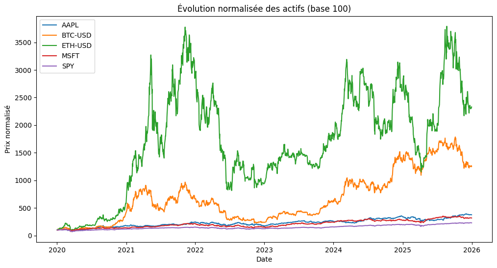
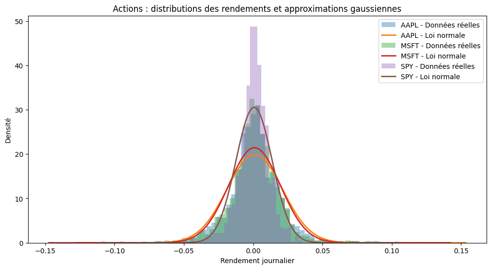
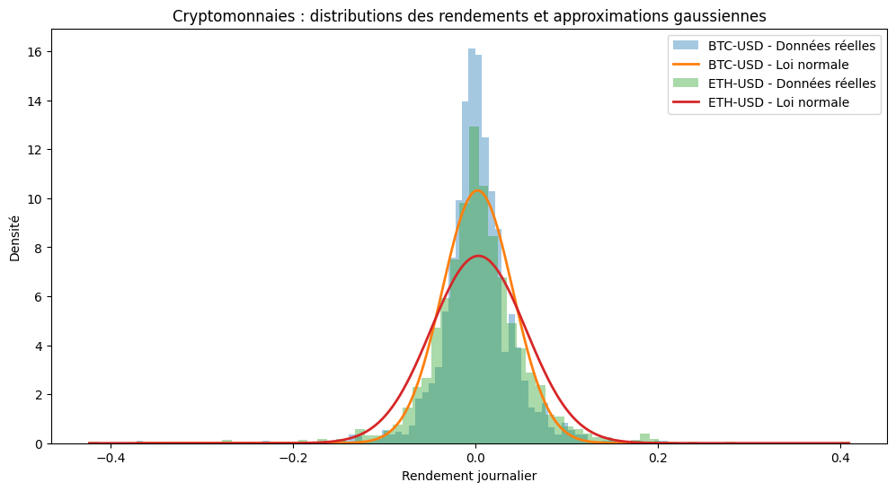
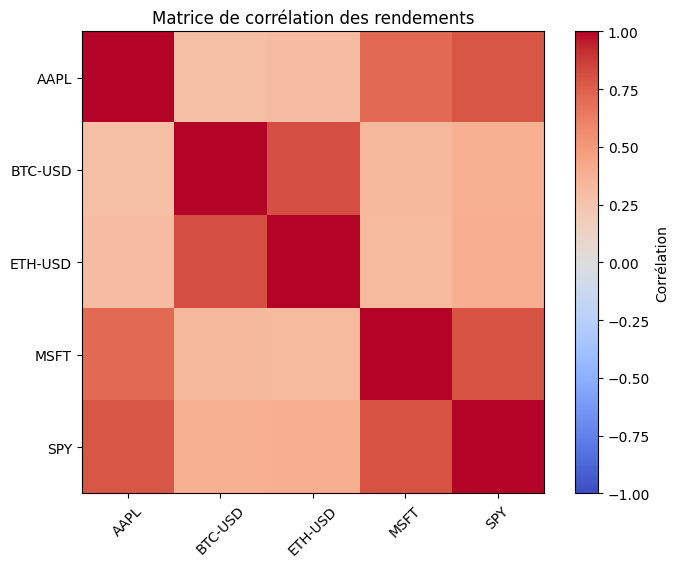

# Analyse comparative du risque : Actions vs Cryptomonnaies

> **Les cryptomonnaies sont-elles réellement plus risquées que les actifs traditionnels ?**  
> Cette étude applique plusieurs outils de finance quantitative et de gestion des risques afin de comparer le comportement des actions et des cryptomonnaies.

---

## 🎯 Objectifs

- Comparer empiriquement le profil de risque des actions et des cryptomonnaies
- Étudier les distributions de rendements et les événements extrêmes
- Implémenter plusieurs mesures de risque :
  - Volatilité
  - Value-at-Risk (VaR)
  - Expected Shortfall (ES)
- Analyser les corrélations entre actifs
- Étudier l’impact des cryptomonnaies dans un portefeuille diversifié

---

## 📈 Résultats clés

✅ **Volatilité** : Les cryptomonnaies présentent une volatilité largement supérieure aux actifs actions traditionnels  

✅ **Risque extrême** : VaR et Expected Shortfall montrent des pertes potentielles beaucoup plus importantes sur Bitcoin et Ethereum  

✅ **Distributions non gaussiennes** : Les rendements crypto présentent des queues épaisses et des événements extrêmes plus fréquents qu’une loi normale classique  

✅ **Corrélations** : Les cryptomonnaies restent partiellement corrélées aux marchés traditionnels mais conservent un certain potentiel de diversification  

✅ **Portefeuille** : Une exposition modérée aux cryptomonnaies augmente le rendement moyen du portefeuille tout en conservant un effet de diversification partiel  

---

## 🛠️ Stack technique

- **Python**
- **pandas**
- **numpy**
- **matplotlib**
- **scipy**
- **yfinance**

---

## 📊 Visualisations clés

### 1. Évolution normalisée des actifs (base 100)

---

### 2. Distributions des rendements et approximations gaussiennes

#### Actions

#### Cryptomonnaies

> Observation : les distributions présentent des queues épaisses, particulièrement sur les cryptomonnaies, ce qui limite la pertinence de l’hypothèse gaussienne.

---

### 3. Matrice de corrélation

> Les cryptomonnaies restent positivement corrélées aux marchés actions, mais avec une intensité plus faible que les corrélations observées entre actions traditionnelles.

---

## Auteur
Nadim Coindet — Master 1 Mathématiques, Sorbonne Université
